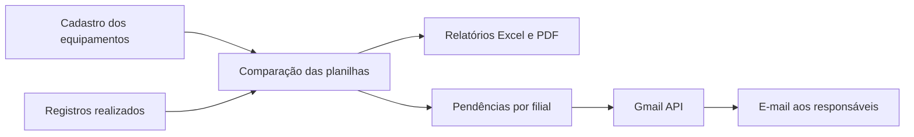

# Checklists de equipamentos e inventário de paleteiras

Este projeto ajuda a acompanhar os checklists dos equipamentos e o inventário das paleteiras. Ele compara duas planilhas, identifica o que precisa de atenção e prepara os relatórios e os e-mails para os responsáveis de cada filial.

Em vez de conferir cada equipamento manualmente, você atualiza as planilhas e executa o programa. O resultado fica disponível em Excel, para consultar os detalhes, e em PDF, para visualizar os indicadores e compartilhar por e-mail.

| Automação | Identificação do equipamento | O que analisa |
| --- | --- | --- |
| `checklist.py` | Placa | Último checklist, prazo, tipo realizado e código da filial |
| `paleteiras.py` | QR Code | Leitura de inventário, prazo e custo dos equipamentos pendentes |

Os dois programas funcionam separadamente: você pode executar só o checklist, só as paleteiras ou ambos. Cada um utiliza suas próprias duas planilhas, mas os dois compartilham as configurações de e-mail.

## Por onde começar

- **Primeira utilização:** siga [Instalação e configuração](#instalação-e-configuração-passo-a-passo). A configuração inicial do Google pode ser feita com apoio da TI.
- **Computador já configurado:** vá direto a [Como executar no dia a dia](#como-executar-no-dia-a-dia).
- **Dúvidas sobre o resultado:** consulte [Paleteiras](#inventário-de-paleteiras--paleteiraspy) ou [Checklists](#checklists-de-equipamentos--checklistpy).
- **Problemas com o envio:** consulte [Gmail API](#gmail-api-como-configurar-o-envio) e [Problemas comuns](#problemas-comuns).

## O que acontece quando o programa roda

1. Confere se as duas planilhas foram encontradas.
2. Compara o cadastro dos equipamentos com os registros realizados.
3. Identifica os equipamentos no prazo e os que precisam de atenção.
4. Calcula os totais de cada filial e gera os arquivos Excel e PDF.
5. Envia um e-mail para os grupos que têm problemas e destinatários configurados.



O checklist verifica prazo, tipo e filial. O inventário de paleteiras verifica as leituras e o prazo, além de somar o custo cadastrado dos equipamentos pendentes.

## Tecnologias utilizadas

Você não precisa conhecer todas estas ferramentas para executar o projeto. Elas são as peças que fazem a automação funcionar:

| Tecnologia | Para que serve aqui |
| --- | --- |
| Python | Executa as instruções do programa |
| Pandas | Compara e organiza os dados das planilhas |
| OpenPyXL | Permite ler e gravar arquivos Excel |
| ReportLab e Pillow | Criam os PDFs com gráficos, tabelas e logo |
| Gmail API e bibliotecas do Google | Fazem o envio dos e-mails pela conta autorizada |
| Google OAuth 2.0 | Permite autorizar o programa na tela do Google |
| python-dotenv | Lê os caminhos, prazos e destinatários do arquivo `.env` |
| Excel | Formato das bases de entrada e dos relatórios detalhados |
| OneDrive/SharePoint, quando utilizado | Mantém as planilhas disponíveis em uma pasta sincronizada no computador |

## Antes de começar

Tenha um computador com Python **3.11 ou superior**, os arquivos deste projeto e acesso às planilhas da automação que deseja executar. Para enviar e-mails, também será necessário acesso à internet e a uma conta com Gmail habilitado.

O **PowerShell** é a janela do Windows onde os comandos deste guia serão digitados. Abra a pasta do projeto no Explorador de Arquivos, digite `powershell` na barra de endereço e pressione Enter. Assim, os comandos serão executados na pasta certa.

Confira se o Python está instalado:

```powershell
python --version
```

Se o Windows não reconhecer `python`, tente `py --version`. Caso apenas `py` funcione, use `py` no comando de criação do ambiente virtual abaixo. Se nenhum funcionar, instale o Python e abra uma nova janela do PowerShell.

## Estrutura

```text
checklist.py                 # Execução da análise de checklists
paleteiras.py                # Execução do inventário de paleteiras
automacao/
    mensagem_email.py        # Montagem do e-mail e do anexo
    relatorios_pdf.py        # Dados, gráficos e diagramação dos PDFs
logo/logo.png               # Logo utilizada nos cabeçalhos
cloud/                      # Páginas públicas usadas na configuração OAuth
    politica-de-privacidade.html
    termos-de-servico.html
tests/                      # Testes com dados fictícios e envio simulado
.env.example                # Modelo público de configuração
requirements.txt            # Dependências de execução
requirements-dev.txt        # Dependências adicionais de desenvolvimento
```

Os arquivos `.env`, `credentials.json`, `token.json`, as bases em `dados/` e os relatórios em `saida/` são locais e ignorados pelo Git. As bases também podem ficar em uma pasta sincronizada externa ao projeto.

| Arquivo ou pasta | Explicação simples |
| --- | --- |
| `checklist.py` e `paleteiras.py` | Os programas que você executa |
| `.env` | Sua ficha de configuração: localização das planilhas, prazos e destinatários |
| `.env.example` | Modelo para criar essa ficha; não é usado na execução |
| `credentials.json` | Identifica este aplicativo na configuração do Google |
| `token.json` | Guarda a autorização da conta que enviará os e-mails |
| `saida/` | Pasta onde os relatórios ficam após a execução |
| `cloud/` | Páginas de política de privacidade e termos de serviço |

## Instalação e configuração passo a passo

### 1. Obter o projeto

Se você já está com os arquivos no computador, passe para a etapa 2. Caso contrário, abra o [repositório no GitHub](https://github.com/lcssilvaa/aut-inv-paleteiras), escolha **Code → Download ZIP**, extraia o arquivo e abra a pasta extraída.

Se você já utiliza Git, a alternativa é:

```powershell
git clone https://github.com/lcssilvaa/aut-inv-paleteiras.git
cd aut-inv-paleteiras
```

### 2. Preparar o Python para este projeto

O ambiente virtual é uma pasta que guarda as ferramentas de Python usadas pelo projeto. Crie-o uma vez, no PowerShell aberto na pasta do projeto:

```powershell
python -m venv .venv
```

Depois instale as bibliotecas necessárias:

```powershell
.\.venv\Scripts\python.exe -m pip install --upgrade pip
.\.venv\Scripts\python.exe -m pip install -r requirements.txt
```

Espere os comandos terminarem antes de continuar. Este guia usa o Python diretamente de dentro da pasta `.venv`, portanto não é necessário ativar o ambiente ou mudar as permissões de execução do PowerShell.

### 3. Criar sua configuração local

Na primeira configuração, crie o `.env` sem sobrescrever uma configuração existente:

```powershell
if (-not (Test-Path -LiteralPath .env)) {
    Copy-Item -LiteralPath .env.example -Destination .env
}
```

Abra o `.env` em um editor, como o Bloco de Notas:

```powershell
notepad .env
```

Cada linha segue o formato `NOME_DA_CONFIGURACAO=valor`. Por exemplo, `PRAZO_DIAS=7` define o prazo das paleteiras em sete dias. Altere o que está à direita do sinal `=` e preserve os nomes à esquerda. Não salve como `.env.txt`.

### 4. Informar as planilhas e os prazos

Preencha no `.env`:

- `SHAREPOINT_DIR`: caminho da pasta com as bases Excel. Prefira um caminho absoluto; no Windows, use `/` entre as pastas.
- `ARQUIVO_BASE_1`, `ARQUIVO_BASE_2` e `ABA_BASE_2`: bases e aba do inventário.
- `CHECKLIST_ARQUIVO_EQUIPAMENTOS` e `CHECKLIST_ARQUIVO_LEITURAS`: cadastro e histórico de checklists.
- `PRAZO_DIAS` e `CHECKLIST_PRAZO_DIAS`: prazos das duas automações.
- `<FILIAL>_EMAIL_1` até `<FILIAL>_EMAIL_9`: destinatários de cada grupo. Campos vazios não recebem mensagens.
- `GMAIL_CREDENTIALS_FILE` e `GMAIL_TOKEN_FILE`: caminhos dos arquivos OAuth. Caminhos relativos são resolvidos a partir da raiz do projeto.

Salve suas alterações no `.env`. O `.env.example` deve permanecer sem configurações pessoais. Em computadores administrados pela TI, configurações já definidas nas variáveis do Windows têm prioridade sobre o arquivo.

Exemplo fictício dos caminhos e prazos no `.env`:

```dotenv
SHAREPOINT_DIR=C:/Dados/Inventario

# Paleteiras: Base 1 = leituras; Base 2 = cadastro dos equipamentos.
ARQUIVO_BASE_1="Gestão Manutenção de Frotas - Controle de Paleteiras.xlsx"
ARQUIVO_BASE_2="Planilha de Paleteiras Disktrans.xlsx"
ABA_BASE_2=Base
PRAZO_DIAS=7

# Checklists: cadastro e histórico de respostas.
CHECKLIST_ARQUIVO_EQUIPAMENTOS="Base Checklist.xlsx"
CHECKLIST_ARQUIVO_LEITURAS="Especifico Cliente - Relatorio BI - Checklist Veicular.xlsx"
CHECKLIST_PRAZO_DIAS=7

GMAIL_CREDENTIALS_FILE=credentials.json
GMAIL_TOKEN_FILE=token.json
```

`SHAREPOINT_DIR` aponta para arquivos disponíveis no computador; o código não baixa as planilhas do SharePoint. Se a pasta for sincronizada, aguarde a atualização e a disponibilidade local dos arquivos antes de executar.

### 5. Fazer a primeira conferência sem enviar e-mails

Deixe todos os campos que contêm `_EMAIL_` vazios no `.env` e confirme que não há destinatários nas variáveis do Windows. Execute uma das automações conforme a seção [Como executar no dia a dia](#como-executar-no-dia-a-dia).

Abra a pasta `saida/` e confira os resultados. Para esta conferência sem envio, não é preciso autorizar uma conta Gmail. Depois, configure o Gmail e faça um teste com apenas uma filial e seu próprio endereço.

## Gmail API: como configurar o envio

### O que é a Gmail API?

É a conexão que permite ao programa pedir ao Gmail que envie as mensagens preparadas pela automação. O programa monta a tabela e o PDF e faz o envio pela conta que você autorizou.

O projeto solicita a permissão `https://www.googleapis.com/auth/gmail.send`, usada para **enviar e-mails em seu nome**. Essa permissão não concede acesso para ler sua caixa de entrada. [Permissões oficiais da Gmail API](https://developers.google.com/workspace/gmail/api/auth/scopes).

**OAuth 2.0** é o nome do processo em que você entra na sua conta pela tela do Google e autoriza o aplicativo. Você não precisa colocar sua senha do Gmail no código ou no `.env`.

### Configuração inicial no Google

Se a conta e o arquivo `credentials.json` já estão configurados neste computador, vá para a etapa de primeiro envio. Para uma configuração nova, siga estes passos; a TI pode auxiliar com as permissões da organização:

1. Abra o [Google Cloud Console](https://console.cloud.google.com/) e crie ou selecione o projeto do bot.
2. Em **APIs e serviços → Biblioteca**, procure **Gmail API** e clique em **Ativar**.
3. Em **Google Auth Platform → Branding**, configure o nome do aplicativo, o contato de suporte e os dados solicitados.
4. Em **Audience**, escolha o público adequado. **Internal** se aplica ao uso dentro de uma organização Google Workspace; **External** atende contas externas. No modo externo de testes, adicione a conta remetente aos usuários de teste. [Públicos e estados do aplicativo](https://developers.google.com/identity/protocols/oauth2/production-readiness/overview).
5. Em **Data Access**, configure a permissão `gmail.send` utilizada pelo projeto.
6. Em **Clients → Create Client**, escolha **Desktop app**, pois o programa roda no computador.
7. Baixe o JSON da credencial, renomeie-o para `credentials.json` e coloque-o junto de `checklist.py` e `paleteiras.py`.

O roteiro de ativação e criação da credencial está no [guia oficial do Google para Python](https://developers.google.com/workspace/gmail/api/quickstart/python). Os nomes dos menus podem aparecer traduzidos no painel.

### Política, termos e duração da autorização

As páginas em `cloud/` devem ser mantidas. Quando forem usadas no cadastro do aplicativo, publique-as em um endereço web acessível e informe os links correspondentes na configuração do Google. Ter o arquivo HTML na pasta do projeto não publica a página nem conclui a verificação do aplicativo. [Configuração da marca do aplicativo](https://developers.google.com/identity/protocols/oauth2/production-readiness/brand-verification).

**Essas páginas não tornam o token permanente.** Para aplicativos externos em modo **Testing** que solicitam `gmail.send`, a autorização de renovação normalmente vence em sete dias. Sair do modo de testes exige configurar a publicação e atender à verificação aplicável; isso não impede todas as causas de expiração ou revogação. [Regras de expiração do Google](https://developers.google.com/identity/protocols/oauth2#expiration).

Por isso, para o uso contínuo do bot, peça ao responsável pelo projeto Google que confira o público, o estado de publicação e as exigências de verificação. Se a autorização for revogada ou não puder ser renovada, será necessário autorizar a conta novamente.

### Primeiro envio e criação do token

1. No `.env`, deixe somente uma filial preenchida com seu próprio endereço, mantendo os outros destinatários vazios.
2. Escolha uma filial que tenha pendências e execute o programa desejado.
3. Quando o navegador abrir, entre na conta que será a **remetente** e revise a autorização solicitada.
4. Após autorizar, volte ao PowerShell e aguarde a conclusão. O programa grava `token.json` e prossegue com o envio.
5. Confira a mensagem recebida, a tabela e o PDF anexado antes de preencher os destinatários definitivos.

O navegador só abre quando houver uma tentativa de envio que precise de autorização. Sem problemas ou sem destinatários para o grupo, não haverá e-mail nem criação do token. Nos próximos envios, o programa reutiliza a autorização salva e tenta renová-la quando necessário.

`credentials.json` e `token.json` devem ficar apenas no computador autorizado. Eles já estão excluídos do versionamento pelo `.gitignore`.

## Como executar no dia a dia

Execute os comandos no PowerShell, dentro da pasta do projeto. Não é necessário ativar o ambiente virtual ao usar o caminho completo do Python abaixo.

Para analisar **somente checklists**:

```powershell
.\.venv\Scripts\python.exe checklist.py
```

Para analisar **somente paleteiras**:

```powershell
.\.venv\Scripts\python.exe paleteiras.py
```

**Executar os scripts gera os relatórios e envia e-mails aos grupos com problemas e destinatários configurados.** Para executar somente a geração de relatórios, deixe os destinatários vazios no `.env` e verifique se não há destinatários definidos nas variáveis do ambiente.

Uma rotina de utilização é:

1. Atualizar as duas bases da automação que será executada.
2. Conferir os nomes dos arquivos, o prazo e os destinatários no `.env`.
3. Fechar os relatórios Excel anteriores para permitir sua gravação.
4. Executar o script desejado e aguardar a mensagem de conclusão.
5. Abrir os arquivos em `saida/` e conferir os totais e as pendências.

Os arquivos de saída são sobrescritos a cada execução. O código não possui agendamento nem controle para impedir o reenvio da mesma cobrança: executar novamente pode enviar novos e-mails enquanto houver pendências.

Quando aparecer **Processamento concluído**, consulte os relatórios em `saida/`. Caso haja destinatários configurados e problemas na filial, o envio já terá sido realizado. As seções seguintes explicam quais informações cada automação espera e como interpretar o resultado.

## Inventário de paleteiras — `paleteiras.py`

### Bases necessárias

**Base 1 — leituras realizadas**, definida por `ARQUIVO_BASE_1`:

- O programa lê a primeira aba e espera os nomes das colunas na **linha 7 do Excel**.
- As colunas obrigatórias são:

| Coluna | Conteúdo |
| --- | --- |
| `CODIGO` | Código lido, usado para identificar o QR Code |
| `FILIAL` | Filial informada na leitura; obrigatória na entrada, mas não comparada com a filial do cadastro |
| `NOME` | Pessoa que realizou a leitura |
| `DATAHORA` | Data e hora da leitura |

O programa aceita datas do Excel e textos como `2026-09-01 10:00` ou `01/09/2026 10:00`. Registros sem QR válido ou sem data válida são descartados.

**Base 2 — cadastro de paleteiras**, definida por `ARQUIVO_BASE_2`:

- O script lê a aba definida em `ABA_BASE_2` — por padrão, `Base` — com o cabeçalho na **linha 1**.
- As colunas obrigatórias são:

| Coluna | Conteúdo |
| --- | --- |
| `FILIAL` | Filial responsável pelo equipamento e pelo recebimento da cobrança |
| `QR Code` | Identificação usada no cruzamento com as leituras |
| `NR_DISK` | Identificação patrimonial exibida no relatório |
| `MODELO` | Modelo da paleteira |
| `CUSTO modelo` | Custo cadastrado, usado na soma dos valores pendentes |

O cadastro define quais equipamentos serão analisados. Uma leitura sem equipamento correspondente no cadastro não entra no resultado. Linhas do cadastro sem QR válido são descartadas.

### Cruzamento e classificação

Antes de comparar as planilhas, o programa padroniza `CODIGO` e `QR Code` para reconhecer o mesmo equipamento mesmo quando a escrita muda. Por exemplo, `123 - descrição` e `00123` correspondem ao QR `00123`: ele usa a parte anterior ao primeiro hífen, retira um eventual `.0` no final, mantém os dígitos e completa com zeros à esquerda até ter pelo menos cinco posições.

**Deixe apenas a leitura mais recente de cada QR na Base 1 e um cadastro por QR na Base 2.** Atualmente, `paleteiras.py` não escolhe sozinho a leitura mais recente quando há várias. Nessa situação, o equipamento poderá aparecer repetido e aumentar os totais e custos. Confira essa preparação da planilha antes de executar.

O vencimento é a data/hora da leitura acrescida de `PRAZO_DIAS`. O status é calculado em relação à data/hora do computador no momento da execução:

| Status | Condição | Entra na cobrança? |
| --- | --- | --- |
| `LIDO` | Há leitura e o vencimento ainda não foi atingido | Não |
| `PENDENTE` | Há leitura e o vencimento foi atingido | Sim |
| `NUNCA LIDO` | Não foi encontrada leitura válida na base fornecida | Sim |

Com prazo de 7 dias, uma leitura em 01/09 às 10h vence em 08/09 às 10h. A partir desse horário, passa a `PENDENTE`. `NUNCA LIDO` descreve a ausência de registro no arquivo analisado, não comprova que o equipamento jamais foi inventariado.

O resumo calcula `NAO_LIDOS = PENDENTES + NUNCA_LIDOS` e soma o custo desses dois grupos em `VALOR_PENDENTE`. Custos vazios ou que não podem ser convertidos são tratados como zero. O valor representa o custo cadastrado dos equipamentos pendentes, não uma perda confirmada.

A filial usada para agrupar e cobrar é a `FILIAL` da **Base 2**. Esta automação não verifica divergência entre a filial da leitura e a do cadastro, não valida tipo de checklist e não aplica a coluna `Ativo` do cadastro de checklists.

### Saídas e e-mail das paleteiras

| Arquivo em `saida/` | Conteúdo |
| --- | --- |
| `Resultado_Inventario.xlsx` | Equipamentos analisados, QR, patrimônio, modelo, custo, pessoa (`NOME`), leitura (`DATAHORA`), vencimento, status e dias sem leitura |
| `Resumo_Filiais.xlsx` | Totais por filial, lidos, pendentes, nunca lidos, percentuais e valor pendente |
| `Resumo_Visual_Paleteiras.pdf` | Gráficos, indicadores, resumo e detalhes dos equipamentos |

O e-mail da filial lista somente `PENDENTE` e `NUNCA LIDO`, com QR, patrimônio, modelo, última leitura, dias sem leitura, custo e status. A pessoa que realizou a leitura consta no Excel e nos detalhes do PDF; não aparece na tabela do corpo desse e-mail.

O anexo `Resumo_Paleteiras_<FILIAL>.pdf` inclui todos os equipamentos daquela filial, inclusive os lidos no prazo, para que os percentuais usem o total correto. Filiais sem pendências ou sem destinatários configurados não recebem mensagens.

## Checklists de equipamentos — `checklist.py`

### Bases necessárias

**Cadastro**, definido por `CHECKLIST_ARQUIVO_EQUIPAMENTOS`: primeira aba, cabeçalho na **linha 1**, com `Placa`, `Código Filial`, `Filial` e `Tipo de Equipamento`. A coluna `Ativo` é opcional.

**Histórico**, definido por `CHECKLIST_ARQUIVO_LEITURAS`: primeira aba, nomes das colunas na **linha 6 do Excel**, com estas colunas obrigatórias:

| Coluna | Utilização |
| --- | --- |
| `PLACAVEICULO` | Placa para cruzamento com o cadastro |
| `NOMECHECKLIST` | Tipo de checklist realizado |
| `CODIGOFILIALRESPOSTA` | Código da filial informado na resposta |
| `DATARESPOSTA` | Data/hora usada para selecionar o último checklist e calcular o prazo |
| `ANOMES` | Ano/mês que auxilia na interpretação de datas textuais ambíguas |
| `RESPONDIDOPOR` | Responsável apresentado nos relatórios e no e-mail |
| `DATA` | Campo exigido na importação; o prazo usa `DATARESPOSTA` |
| `RESPOSTALOG` | Campo exigido e carregado do relatório de origem |

O histórico pode conter várias respostas por placa. O código descarta datas inválidas da seleção e mantém o registro de data/hora mais recente por placa, mesmo quando esse registro tem tipo ou filial incorretos.

### Regras de análise

- O cadastro usa `Placa`, `Código Filial`, `Filial` e `Tipo de Equipamento`. A coluna opcional `Ativo` permite excluir equipamentos da análise: `Não` desabilita a placa inteira, inclusive quando há várias linhas dela. Coluna ausente ou valor vazio mantém o equipamento ativo.
- A análise seleciona o último checklist por placa e verifica prazo, tipo e código de filial. O prazo vence ao completar o número de dias configurado.
- Para baterias, somente `Bateria` é aceito. Se o último registro for uma troca inicial, troca final ou outro tipo, o equipamento fica pendente mesmo com um registro recente.
- `STATUS_CHECKLIST` inclui a pendência de bateria; `STATUS_PRAZO` indica exclusivamente a situação do prazo.
- `MANUTENCAO` é um grupo de cobrança. A filial esperada é exibida como `MANUTENCAO`, e a validação usa o código individual cadastrado para cada equipamento.
- `BACKUP` e `FROTAS` têm mapeamentos de exibição em `FILIAIS_OPERACIONAIS`, atualmente para CON quando o código cadastrado é 2. Os grupos mantêm seus próprios destinatários.

Exemplo de manutenção: uma placa cadastrada como `MANUTENCAO` com código 7 precisa ter a resposta no código 7. Outra placa do mesmo grupo com código 20 precisa da resposta no código 20. Ambas são cobradas em `MANUTENCAO`.

Um equipamento pode estar no prazo e apresentar divergência de tipo ou filial. Por isso, o total `OK` do resumo de checklists não significa ausência de toda inconsistência. A lista de problemas inclui pendências **ou** divergências; no PDF, o indicador `Em dia` considera o cumprimento de prazo, tipo e filial. Um mesmo equipamento pode aparecer nas duas tabelas do e-mail quando possui pendência e inconsistência.

### Saídas e e-mail dos checklists

| Arquivo em `saida/` | Conteúdo |
| --- | --- |
| `Resultado_Checklist.xlsx` | Todos os equipamentos ativos analisados, último registro, responsável, prazo, status e inconsistências |
| `Problemas_Checklist.xlsx` | Somente equipamentos com pendência ou inconsistência |
| `Resumo_Checklist.xlsx` | Totais, status e contagens de divergências por grupo |
| `Resumo_Visual_Checklist.pdf` | Indicadores, gráficos, resumo e detalhes |

O e-mail mantém as tabelas de checklists pendentes e de inconsistências, incluindo o responsável. O anexo `Resumo_Checklist_<FILIAL>.pdf` reúne todos os equipamentos ativos do grupo, inclusive os regulares. Grupos sem problemas ou sem destinatários não recebem mensagens.

## Configuração e teste do envio de e-mail

Os destinatários são definidos por grupo, usando de 1 a 9 campos. Exemplo fictício:

```dotenv
CON_EMAIL_1=responsavel@example.com
CON_EMAIL_2=
MANUTENCAO_EMAIL_1=manutencao@example.com
```

As siglas precisam corresponder às aceitas em `carregar_destinatarios()` de cada script. Criar uma nova chave no `.env` não adiciona uma filial à lista do código. Há diferenças entre as listas atuais: por exemplo, checklist usa `MAH` e `SAO`, enquanto paleteiras usa `MHA` e `SÃO`; os grupos `BACKUP`, `FROTAS` e `MANUTENCAO` estão na lista do checklist.

Para testar um e-mail, deixe preenchida somente uma filial com seu endereço no `.env` e execute apenas a automação desejada. Esse grupo precisa ter alguma pendência ou inconsistência que gere cobrança. Os demais destinatários devem ficar vazios, inclusive nas variáveis do ambiente. Como a configuração é compartilhada, a mesma chave, como `CON_EMAIL_1`, serve às duas automações.

Na primeira tentativa de envio, o código abre o fluxo de autorização do Gmail se não houver token válido. Depois, reutiliza o `token.json` e tenta renová-lo quando necessário. O remetente é a conta autorizada nesse fluxo. Os relatórios são salvos antes do envio; uma falha de autenticação pode ocorrer mesmo depois de os arquivos terem sido gerados.

## Problemas comuns

| Situação | O que conferir |
| --- | --- |
| Windows não reconhece `python` | Tente `py --version`; se também não funcionar, instale Python e reabra o PowerShell |
| `No module named pandas` ou outra biblioteca | Execute `.\.venv\Scripts\python.exe -m pip install -r requirements.txt` e use esse mesmo Python para rodar o projeto |
| Base não encontrada | `SHAREPOINT_DIR`, nome do arquivo e disponibilidade local da planilha |
| Colunas não encontradas | Grafia dos cabeçalhos e linha esperada: leituras de paleteiras na 7, histórico de checklist na 6, cadastros na 1 |
| Aba não encontrada | `ABA_BASE_2` deve ser igual ao nome da aba do cadastro de paleteiras |
| Equipamento aparece como nunca lido/realizado | Identificador no cadastro e na base de registros, validade da data e abrangência do arquivo exportado |
| Paleteira repetida no resultado | QR normalizado duplicado no cadastro ou mais de uma leitura por QR na Base 1 |
| Nenhum e-mail enviado | Existência de problemas para o grupo, sigla aceita pelo script e destinatários preenchidos |
| Erro ao salvar Excel | Feche o relatório aberto e confira a permissão de escrita em `saida/` |
| Erro de importação de módulo | Instale as dependências no mesmo Python usado para executar e mantenha a pasta `automacao/` junto dos scripts |
| `Invalid To header` no Gmail | Use um endereço válido por campo `_EMAIL_`, sem nomes, vírgulas ou caracteres extras |
| Google bloqueia a autorização | Confira a conta selecionada, os usuários de teste, o público do projeto e as permissões da organização com a TI |
| Gmail volta a pedir autorização ou mostra `invalid_grant` | Confira a situação do aplicativo e da autorização; siga a orientação abaixo para refazer o acesso |

### Como refazer a autorização do Gmail

Se o token estiver inválido ou for necessário trocar a conta remetente, feche o programa, remova **somente o arquivo de token** indicado em `GMAIL_TOKEN_FILE` e execute novamente com uma filial de teste configurada. O navegador abrirá para uma nova autorização quando o programa tentar enviar o e-mail. Não é necessário remover `credentials.json`.

Se o projeto continuar externo em modo de testes, refazer o login não resolve a duração limitada da autorização. Confira a configuração no Google antes de depender de envios recorrentes.

## Desenvolvimento e testes

```powershell
.\.venv\Scripts\python.exe -m pip install -r requirements-dev.txt
.\.venv\Scripts\python.exe -m unittest discover -s tests -v
```

Os testes simulam o envio de mensagens; não enviam e-mails reais. Alguns testes criam planilhas e PDFs temporários para verificar os arquivos produzidos.

## Arquivos para o GitHub

Versione o código, os testes, a logo, a documentação, as dependências e o `.env.example` vazio. O `.gitignore` exclui configurações locais, credenciais e tokens, bases Excel/CSV/Parquet, PDFs, relatórios, logs, caches e ambientes virtuais. Não use `git add -f` para incluir esses arquivos.

Antes de publicar, confira `git status --short` e o conteúdo das alterações. O `.gitignore` não remove arquivos já presentes em commits antigos.
